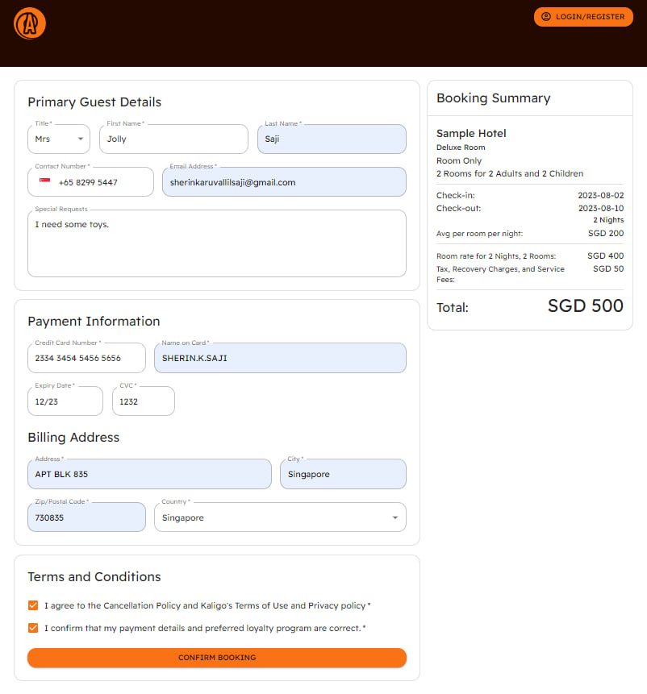

# Ascendas-Hotel-Booking
Case study on building white-label hotel booking sites. Project by Ascendas Loyalty, for SUTD 50.003 Elements of Software Construction module.

To get started,
clone the project.
run npm install on terminal.

To view payment page and booking api in action,
split terminal.

On one terminal, run: npm run dev

On the second terminal, run:  npx ts-node-dev src/pages/api/db/bookingServer.ts

Then open http://localhost:3000/payment in your browser.

Here is an image of what you will see:

